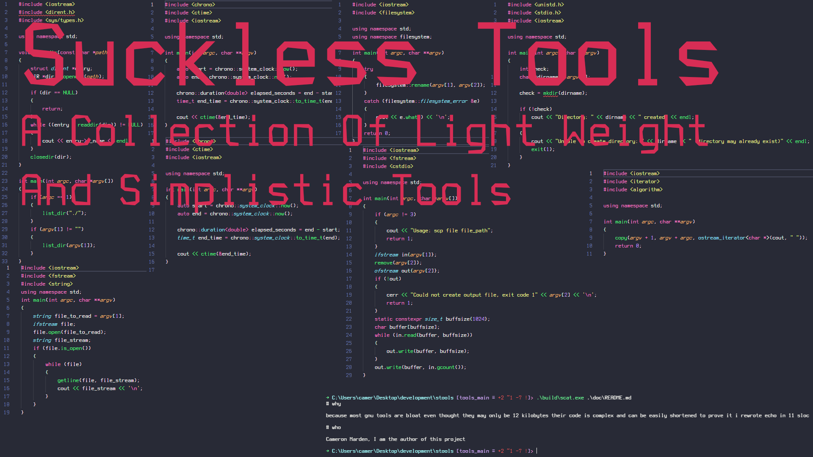

# why

because most gnu tools are bloat even thought they may only be 12 kilobytes their code is complex and can be easily shortened to prove it i rewrote echo in 11 sloc

# who

Cameron Marden, I am the author of this project
